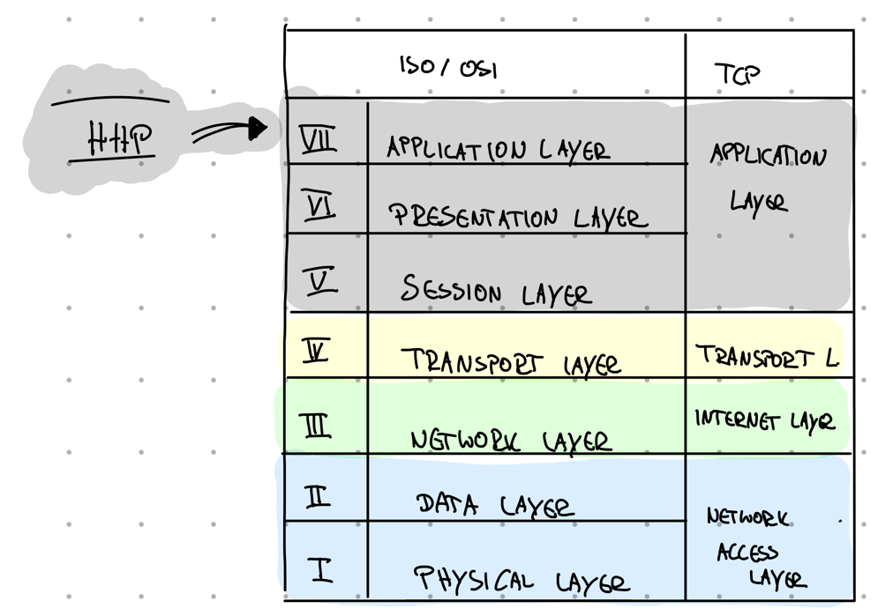

+++
title = 'HTTP -- this thing what you think is ReST  '
date = 2023-06-10T20:58:54+02:00
tags = [ "apis", "http" ]
categories = [ "architecture", "api",]
draft = false
+++

## Intro
I often read in applications that the candidates know `ReST`. When they are asked what the quintessence of `ReST` is and how it differs from `HTTP`, i rarely get a satisfactory answer. Therefore, let's first have a look at `HTTP` a.k.a. what most developers understand by a ReST API.

## Idea
The base idea behind `HTTP` is that we use the magic that the web provides us with free of charge. 

### Where does it come from?
`HTTP`, short for `Hypertext transfer protocol`, is a stateless protocol of the applicationlayer in the ISO/OSI web model. This layer is used by application for exchange information. Stateless is similar to memory- or history-less: Every session feels like a brand new one. That means: If you call a website twice, you wouldn't be recognise again (to be so, there are some tricks, like using cookies).

### Let them talk to eachother! 
#### Common language
`HTTP` doesn't require a specific language like gRPC. There is a common structured unit -- known as a`messge`-- that acts as exchangeable information and is understood by every node on the web.
A message contains a header (here we find some base information and metadata) and the actual message body. Messages from a client to a server are called `requests`. Answers from the server back to the client are `responses`. 

### Don't need for any adapaters: Everyone speaks the same language, everyone understand eachother

#### HTTP verbs
A key feature that `HTTP` brings to the table are the so-called`verbs`. These verbs are familiar to all nodes of the web, i.e. each node knows how to use them or react to them. The most used are `GET`, `POST`, `PUT`and `DELETE`. 

Verbs are like buckets for different operations. Almost every method of your API can be sorted into one of these four buckets (and if not so: HTTP provides some few more verbs).

For instance:
- consuming behaviour, like reading something fits into `GET`
- methods, which create something new can be thrown into the `POST` bucket (btw: this "_something new_" is called a `resource`and is accessible via an URI afterwards)
- every functionality for updating a existing resource is a `PUT`
- and `DELETE` is... ja... you know...

Besides `POST` all of the others from this list are idempotent. 

#### Known buckets = known behaviour
This approach of a basic set of buckets that bundle your individual methods leads to a generic 'everyone-knows-it'-toolset. Even if your counterpart doesn't know what `getYoloId()`explicity means, the `GET` bucket provides the necessary information do deal with it.

  `HTTP` is also language agnostic, meaning, that as long as a suitable library is provided, it can be used by every programming language. Therefore, you can write your API in both JAVA and Javascript and it will do the same.

Another plus:  It's not only a generic everyone-knows-it toolset for different commuication partner. Because it's well defined, additional tools can understand it too. Tools like the browser, which enable debugging or caching.

[//]: # ( And if you just want to test a your API without runnning any snippet of code, `curl` allows this. )

## Technical basic
The most common way to define a `HTTP` web api is to describe it like the following example shows. 

| URI                                        | METHOD | MEANING                                                |
|--------------------------------------------|--------|--------------------------------------------------------|
| https://store.com/v1/customers             | POST   | create a new customer                                  |
| https://store.com/v1/customers/{id}        | GET    | get customer details                                   |
| https://store.com/v1/customers/{id}/orders | GET    | get a list of customer's details (here his/her orders) ||

Meanwhile, there are also very good standards for this, such as [swagger](https://swagger.io/resources/articles/best-practices-in-api-design/), which supports a standardization of the end points and relieve us of a great deal of typing work.

###  Conclusion
After this brief introduction to the basics of `HTTP`, let's now summarize the advantages and disadvantages of this type of API:

| Yay                                                        | Nay                                                                                                       |
|------------------------------------------------------------|-----------------------------------------------------------------------------------------------------------|
| Easy to use                                                | static usage of a dynamic approach -> also means creating a static relationship between client and server |
| Generic, HTTP based semantic                               | URIs a re part of the API description (that means: the position of your params become important           |
| Wide tool support                                          | Changes of URI means changing of your API                                                                 |
| Widely accepted                                            | Tighter coupling                                                                                          |
| Standard exchange formats, like XML, JSON...               |                                                                                                           |
| Strong focus on server side logic , low demand on consumer |                                                                                                           |
| API description support by tools, like OpenAPI/Swagger     |                                                                                                           |

### Attention
`It's contrary to common practice, BUT: Avoid using this type of API style for public APIs that you need to maintain over time.`

It's your contract to the outer world. If you make.e.g. the structure of a URI part of your API description, you have conveyed some hard facts to the outside world. Your clients will rely on this information. Changing the URI, perhaps due to versioning, is a breach of the contract.
