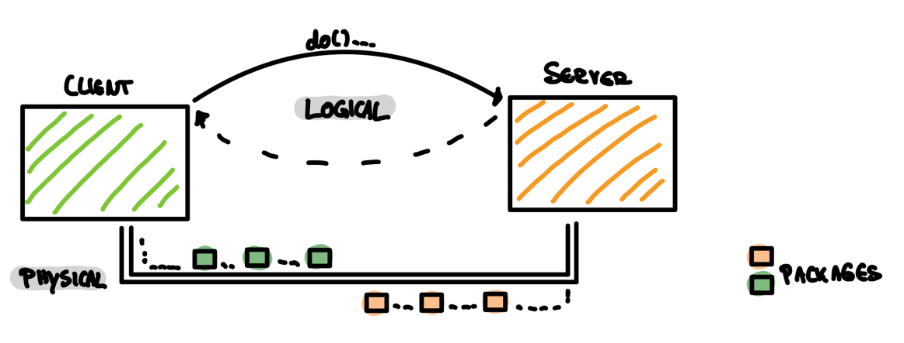

+++
title = 'gRPC -- Makes Google remote procedure calls (finally) cool? '
description = "it's about googles interpretation of RPC, when to use and when not" 
tags = [ "apis", "grpc" ]
categories = [ "architecture", "api",]
date = 2023-10-21T20:58:54+02:00
draft = false
+++


## Intro
Those who thought `Remote Procedure Calls (RPC)` were an old shoe have been taught better with the offshoot `gRPC developed by Google. I was introduced to RPC on and off with appalling regularity at university. Primarily at that time as CORBA. In some projects of my past working life I also came across old SOAP APIs from time to time. Neither of them made me love RPC very much. So now gRPC as the newest child of the RPC family is vying for our favor.


## Idea
Remote Procedure Calls based on a very simple idea: We take stuff we know from our local system (like calling some procedures or methods) and transfer them to the distributed world.


The overall goal would be almost instantaneous, distributed and shared task processing on different nodes from wherever. But there is nothing like a free lunch: Instantaneous is nothing we have in communication networks.


## Technical basic


gRPC is used for client/server-communications.
As always, client and server communicate in two ways:
* Firstly, in a logical way (a calls b for solving a problem) and also on a
* physical way (connect a and b via cable for instance).

The job of gRPC is to encapsulate the physically communication part.

To let partners communicate who do not necessarily speak the same language, gRPC has do two main jobs:
* define a common understandable language
* a kind of communication adapters on client and server side


### A common understandable language
> The limits of my language mean the limits of my world.
> -- <cite>Ludwig Wittgensteins</cite>

Languages based on known rules (e.g. grammar and certain vocabulary). If these rules are known among the communication participants, they can communicate with each other on the level of this language.
With gRPC the so called protocol buffer (_protobuf_) takes over this task.

#### THE _protobuf_: An IDL (Interface Definition Language)
... it's the HOW WE TALK as an declared interface in a language independent way. Language independent means: It can be written in a proper programming language, but i does not have to be. It can be written in same language like our system, but again: doesn't have to be.

Interface means (very straight forward):Defining services and methods as a communication toolset between the partner. Each one knows these tools (methods), the needed additional (parameters) and the expected answer (return value) to communicate with someone else in a highly efficient way.

If you find some files with a ```.proto``` ending -> this is a protobuf.


#### THE _adapters_: Stubs and Skeletons
A interchangeable language by itself doesn't mean client and server are able to talk to each other. They also need some kind of adapters for exchange messages between each other. Magically, the construction plan for these adapters is also encoded in the protobuf. To decode it, it needs a special tool gRPC delivers us, the so called IDL compiler. The IDL compiler generates a so called stub on the client side as well as a skeleton on the server side. Stub and skeletons are fully functionally programs and adapters between our system code and the gRPC magic.


### Workflow
Because we communicate via a network we deal with packages in the physically layer between client and server. These packages has to (de-)serialize on both sides, e.i. packing things and send it to the server as well as receiving an answer and unwrap it on the client side. And on the server side we have to unwrap things the client sends us and generate method calls.


### Advantages: General RPC
* Contract driven communication between client and server

Because of the shared interface as a formalize, machine readable interface description between client and server, it has to be specified exactly what the client expected from the server to deliver.

### Disadvantages: General RPC
* `Tight coupling between client and server:` Yes, there is an interface between them, but we have to be aware to keep both, client and server, up to date. Differences, e.g. different interface versions, are the death blow during the runtime for this kind of communication.

* `Redeployment:` Is a consequence of the first point -- Changes of the interface need to be known by the client and server. This will only be so after an update.

* `Incompatibilities:`
  Is another consequence. The version of the interface changes, and some side breaks somehow.

* `Illusion of transparency:` Although it (should) feels like there is not network between them, it is. If you believe this illusion you can run into serious problems.

* `You have to know each other:` At the begin of this article i told you, we can use gRPC for different kind of clients and servers. It's not the whole truth: In reality, you have to know your opposite very well.

### Disadvantages: gRPC
* `No generic semantic:`
  Have to invent and define by your own. It's unique protocol (on the semantic layer).

* `Limited compatibility and static relationships between client and server`
* `It's much harder to consume it (in comparison e.g. with a Http api)`


### So why gRPC?
Some of the previous issues are not that presents in Google's version of RPC. Secondly: In some cases we don't need to worry about these, because our project/system context allows us not to.

###  Bingo points gRPC
* Based on Googles Protocol Buffer as a efficient, binary exchangeable format
* Based on  HTTP/2
* Field index support for meta information to survive some version incompatibilities
* Supports streaming

###  Conclusion
| When to use it?                      | When to avoid it?                                                                             |
|--------------------------------------|-----------------------------------------------------------------------------------------------|
| High throughput?                     | Need public Apis? Only use it when there is no alternative and you are willing to ship SDKs!! |
| High performance needed? (*)         |                                                                                               |
| Efficient resource usage needed? (*) |                                                                                               |
| Know or own your clients?            |                                                                                               |

(*) Performance and resource usage efficiency is given by the binary exchange format. 

